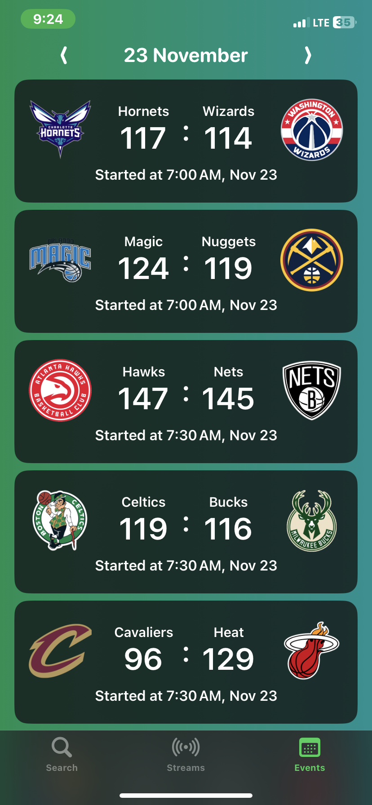
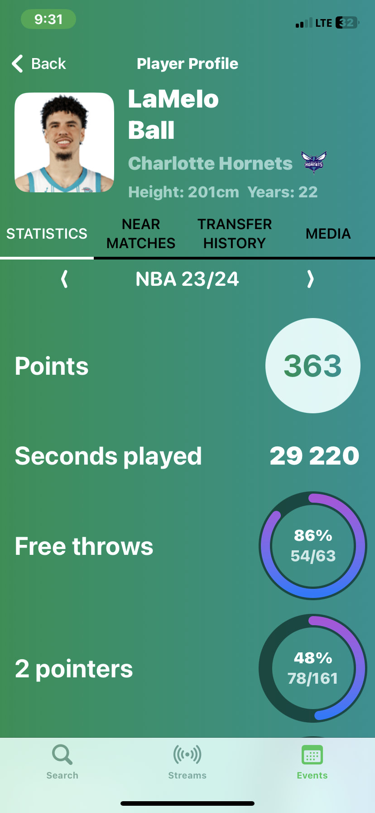
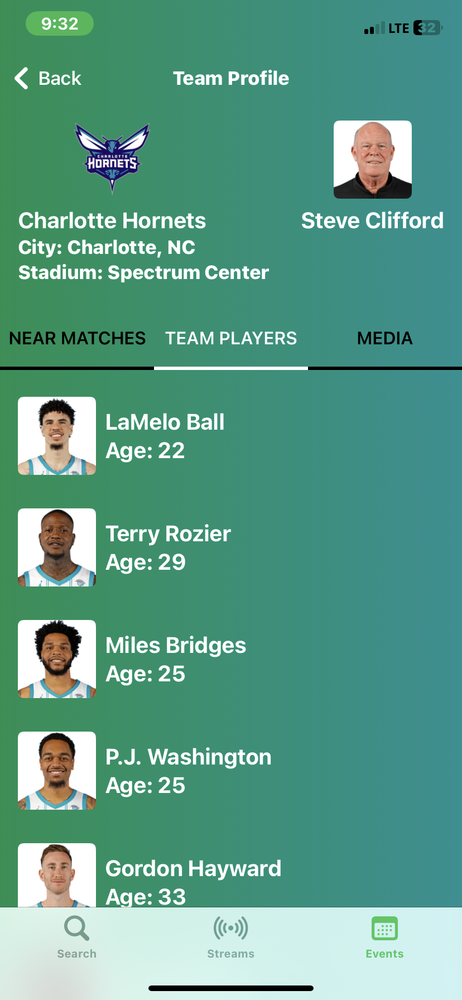
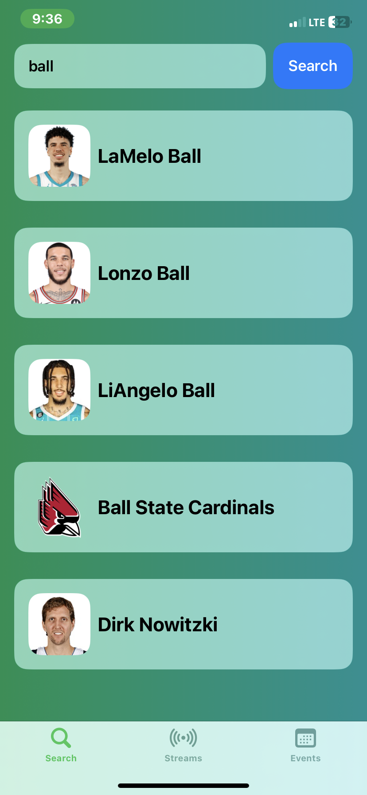
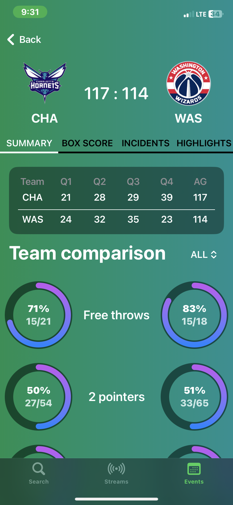
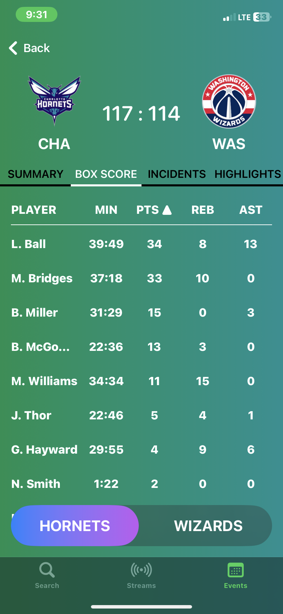
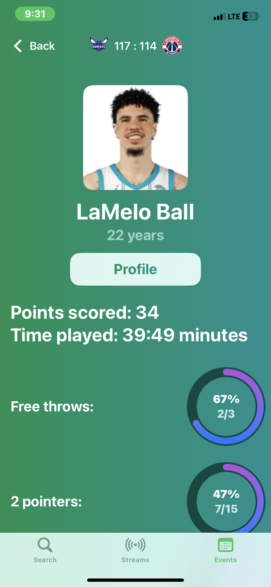

# TraceNBA

TraceNBA is a mobile application designed for true basketball and NBA fans. With this application, you can access real-time information about NBA matches, player and team statistics.

With TraceNBA, you will always be up to date with the latest match results, schedules of upcoming games, and have the opportunity to watch match highlights. Additionally, the application offers detailed player statistics for matches and seasons, allowing you to dive deeper into the world of basketball and analyze games.

Thanks to its convenient and intuitive interface, TraceNBA allows you to stay informed about what's happening in the NBA and enjoy every moment of the game.

# Screenshots

